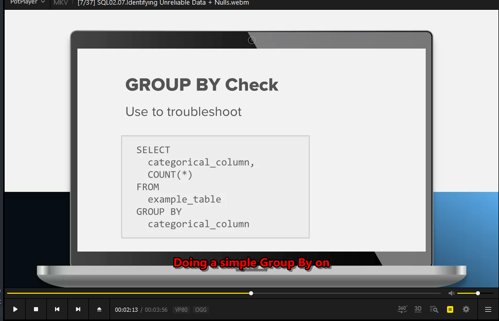
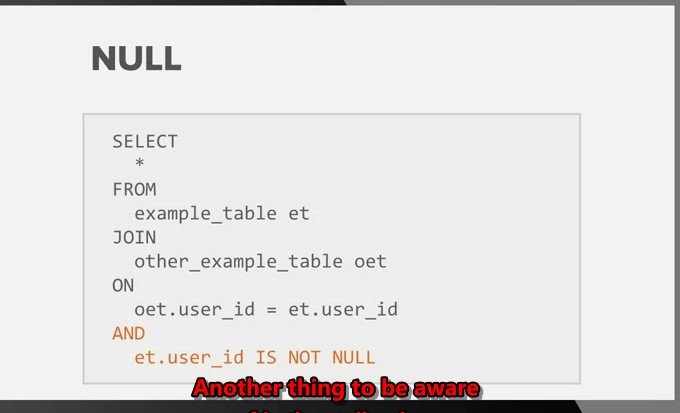

#there is deffrence between count and count distict
```sql
SELECT
  COUNT(event_id) AS events
FROM dsv1069.events
WHERE event_name = 'view_item'
```


the right is
```sql
SELECT
  COUNT(DISTINCT event_id) AS events
FROM dsv1069.events
WHERE event_name = 'view_item'
```


#EVENTS TABLE
pivoting data

receipts of real things that happened.
not edited or updated once they're created.

#ID the unreliable data

1. the name of the table
if it has temp or a date it might been for one off analysis (not good)
2. how long the name is

if it's very long that means it was created for single purpose

3. group by check


  

4. check null vaule



as it could create some problems


every single null == null will group by

#### tip COALESCE()
use COALESCE() to fix nulls

```sql
--use
descripe tablename;
```


##creat new table why ?
1. for cleanliness Easier to read future queries
2. efficiency computing once reuse again
3. standardization for future use with coworkers

## think about
up streams that feeds the data table
tables doesn't created yet
down streams that takes out the data

creat view_item
```sql
create table
  view_item_events_1
as
  select  event_id,
          event_time,
          user_id,
          platfrom,
          max(CASE  WHEN   PARAMETER_NAME = 'ithem_id'
                    then paramater_value
                    else null
              END) as referrer
from
  events
where
      event_name = 'view_item'
group by
  1 , 2 , 3 , 4
order by
  1
descripe view_item_events_1;
select * from view_item_events_1 limit 10;
drop table view_item_events_1;
```
create the table it self
```sql
create table 'tablename' (
event_id    VARCHAR(32) NOT NULL primary key,
event_time  VARCHAR(32),
user_id     int(10),
platfrom    VARCHAR(10),
ithem_id    int(10),
referrer    VARCHAR(17),
);
```

###why partition the data
1. update faster
2. retrieval faster
3. joins faster

###partition on
1. date


### answer question
1. get the question right
2. ID the columns needed
3. ID the tables needed for this columns
4. build subqueries
5. test the joins
6. left or right null or not
7. add the columns then check
8. add conditions
9. make it look better
10. give the columns a better name

###Test Queries vs Final Queries
check no need to polish
if asked more the question I need to clean
1. descriptive sub table names
2. columns names
3. edge some found and handled if they would change the decision
4. related question answered consistently 
