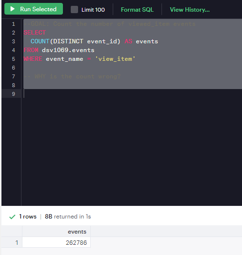

#there is deffrence between count and count distict
```sql
SELECT
  COUNT(event_id) AS events
FROM dsv1069.events
WHERE event_name = 'view_item'
```


the right is
```sql
SELECT
  COUNT(DISTINCT event_id) AS events
FROM dsv1069.events
WHERE event_name = 'view_item'
```



#EVENTS TABLE
pivoting data

receipts of real things that happened.
not edited or updated once they're created.
