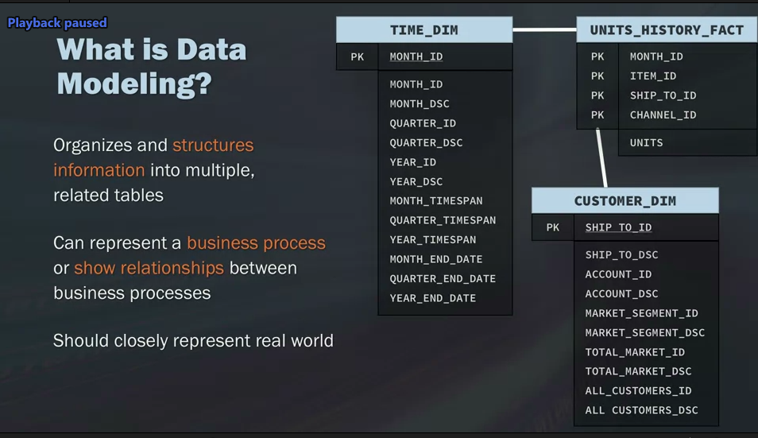
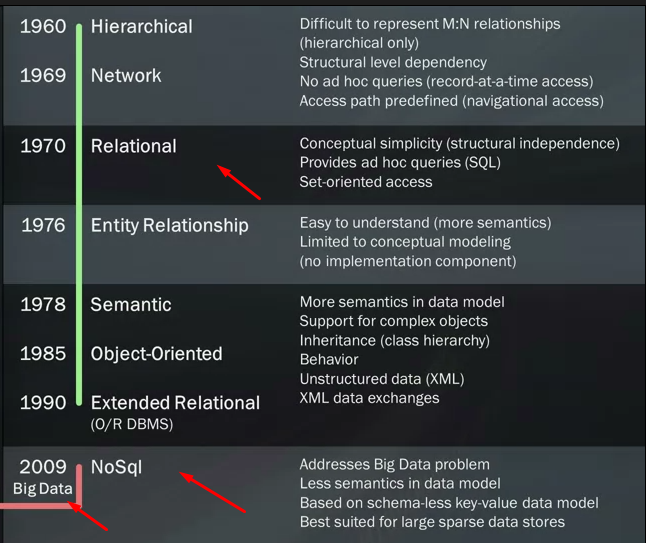
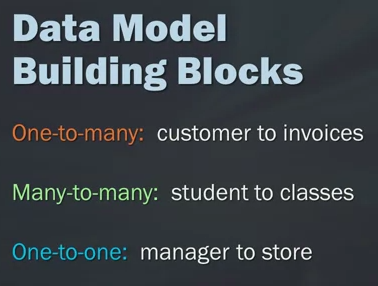
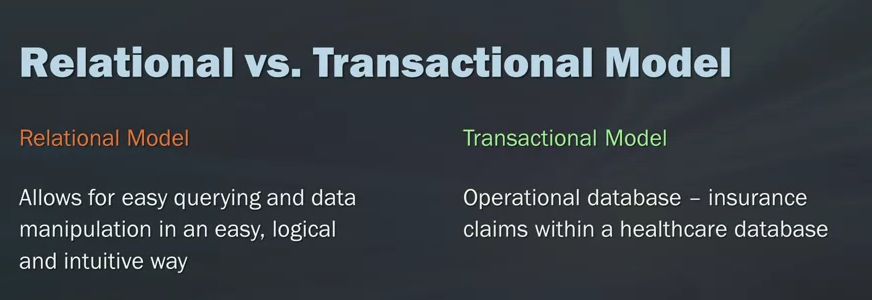
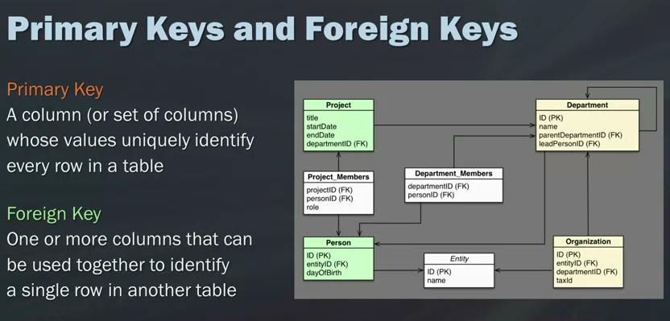
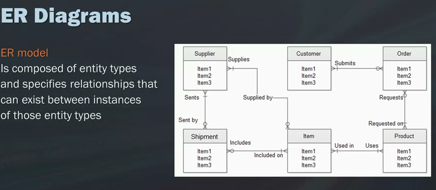
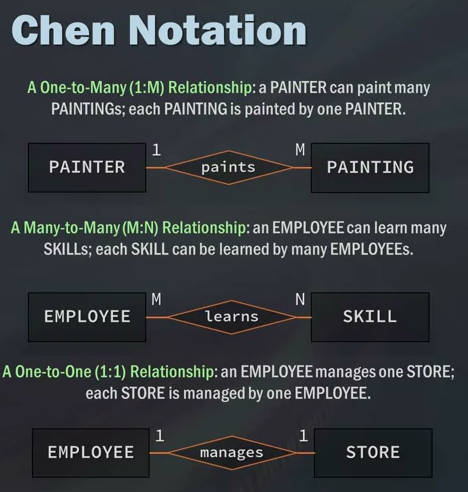
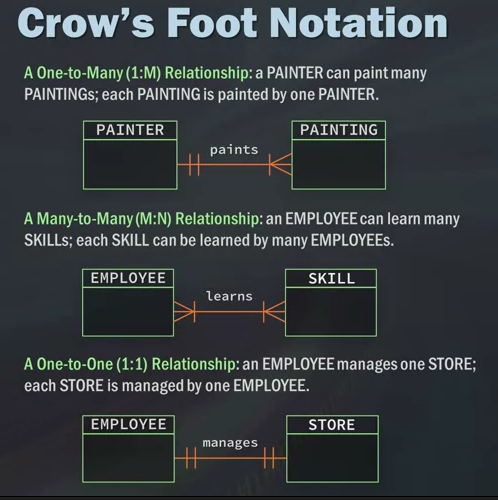
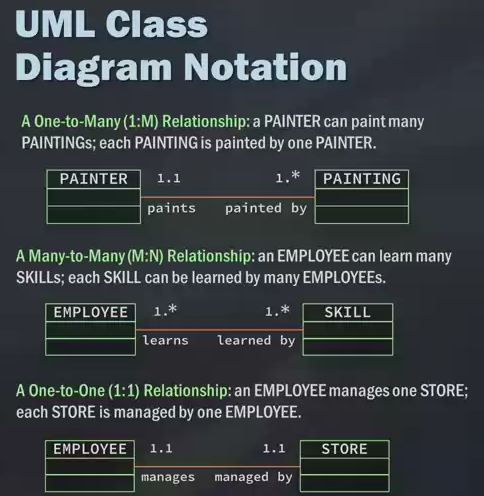
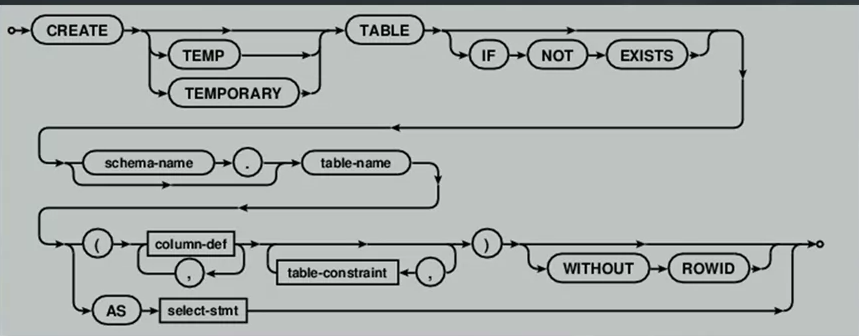

#01 SQL for Data Science

##Selecting and Retrieving Data with SQL

####  LectureWhat is SQL Anyway?

#### LectureData Models, Part 1: Thinking About Your Data
1. the bussiness process
2. the data it self
3. get more accuate
4. less work

Database > tables > rows, columns

#### Data Models, Part 2: The Evolution of Data Models
**Data Models**:



####  LectureData Models, Part 3: Relational vs. Transactional Models


what to remmeber
1. Relational and Transactional DB models 
2. entities, attributes , relationships
3. One to one one to many many to many relationships

4. Primary key 
5. ER Diagram 
  1. Chen Notation
        
  2. crows foot
       
  3. UML
       

####  Retrieving Data with a SELECT Statement
what u want to select and where do want it from
```SQL
select column_name
from table;
```
```SQL
select column_name, column_name2
from table;
```
better way to type it

```SQL
select column_name
       ,column_name2
       , column3
from table;
```

```SQL
select *
from table;
```

we might need to limit

```SQL
select column_name
from table
limit number_of_what u want
```

## deffs in `limit`
sqlite limit
```SQL
select column_name
from table
limit number_of_what u want
```
oracle limit
```sql
select column_name
from table
where ROWNUM <= 5
```

BD2 limit
```SQL
select column_name
from table
FETCH FIRST 5 ROWS ONLY;
```

#### Creating Tables

```sql
CREATE table tablename
(
   col1    char(10)      Primary key
  ,col2    char(20)      NOT NULL
  ,col3   decimal(8,2)   NOT NULL
  ,col4   Varchar(750)   Null

)

insert into tablename
  values(
     val
    ,vals
    ,vals

  )

  insert into tablename
    (
       col1
      ,col2
      ,col3

    )
    values(
       val
      ,vals
      ,vals
  )
```
#### Creating Temporary Tables

```sql
create Temporary table name as (
  select *
  from table
  where cond

)
```


#### Adding Comments to SQL
single line --
```sql
select column_name
      -- ,column_name2
       , column3
from table;
```
section
```sql
select column_name
    /*   ,column_name2
       , column3 */
from table;
```


#### Quiz  Module 1 Coding Questions

## module 2
In this module, you will be able to use several more new clauses and operators including WHERE, BETWEEN, IN, OR, NOT, LIKE, ORDER BY, and GROUP BY. You will be able to use the wildcard function to search for more specific or parts of records, including their advantages and disadvantages, and how best to use them. You will be able to discuss how to use basic math operators, as well as aggregate functions like AVERAGE, COUNT, MAX, MIN, and others to begin analyzing our data.

### Learning Objectives
- Compare analytics tool and CPU time performance between a filtered and unfiltered dataset.
- Given a dataset analysis requirement, use WHERE, IN, NOT, AND, and OR alone or in combination to filter the dataset.
- Determine whether or not to use wildcards in a data filter or search situation.
- Use wildcards to search or filter data based on requirements. Use regular expressions for text processing
- Use ORDER BY to sort data according to requirements for number of columns in the sort, sort direction, and sort position.
- Create common math operation calculated fields and aliases for calculated fields.
- Use AVG, COUNT, MAX, MIN, SUM to profile data.
- Summarize data according to one or more criterion using GROUP BY and HAVING clauses.
