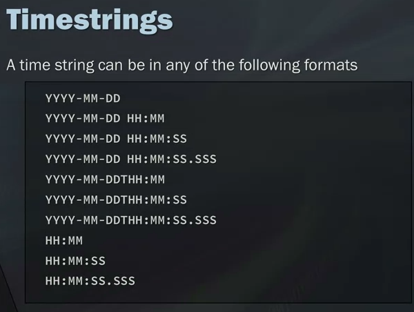
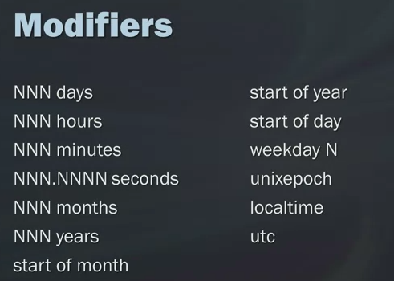

#01 SQL for Data Science

##Selecting and Retrieving Data with SQL

####  LectureWhat is SQL Anyway?

#### LectureData Models, Part 1: Thinking About Your Data
1. the bussiness process
2. the data it self
3. get more accuate
4. less work

Database > tables > rows, columns

#### Data Models, Part 2: The Evolution of Data Models
**Data Models**:


####  LectureData Models, Part 3: Relational vs. Transactional Models


what to remmeber
1. Relational and Transactional DB models 
2. entities, attributes , relationships
3. One to one one to many many to many relationships

4. Primary key 
5. ER Diagram 
  1. Chen Notation
        
  2. crows foot
       
  3. UML
       

####  Retrieving Data with a SELECT Statement
what u want to select and where do want it from
```SQL
select column_name
from table;
```
```SQL
select column_name, column_name2
from table;
```
better way to type it

```SQL
select column_name
       ,column_name2
       , column3
from table;
```

```SQL
select *
from table;
```

we might need to limit

```SQL
select column_name
from table
limit number_of_what u want
```

## deffs in `limit`
sqlite limit
```SQL
select column_name
from table
limit number_of_what u want
```
oracle limit
```sql
select column_name
from table
where ROWNUM <= 5
```

BD2 limit
```SQL
select column_name
from table
FETCH FIRST 5 ROWS ONLY;
```

#### Creating Tables

```sql
CREATE table tablename
(
   col1    char(10)      Primary key
  ,col2    char(20)      NOT NULL
  ,col3   decimal(8,2)   NOT NULL
  ,col4   Varchar(750)   Null

)

insert into tablename
  values(
     val
    ,vals
    ,vals

  )

  insert into tablename
    (
       col1
      ,col2
      ,col3

    )
    values(
       val
      ,vals
      ,vals
  )
```
#### Creating Temporary Tables

```sql
create Temporary table name as (
  select *
  from table
  where cond

)
```


#### Adding Comments to SQL
single line --
```sql
select column_name
      -- ,column_name2
       , column3
from table;
```
section
```sql
select column_name
    /*   ,column_name2
       , column3 */
from table;
```


#### Quiz  Module 1 Coding Questions

## module 2
In this module, you will be able to use several more new clauses and operators including WHERE, BETWEEN, IN, OR, NOT, LIKE, ORDER BY, and GROUP BY. You will be able to use the wildcard function to search for more specific or parts of records, including their advantages and disadvantages, and how best to use them. You will be able to discuss how to use basic math operators, as well as aggregate functions like AVERAGE, COUNT, MAX, MIN, and others to begin analyzing our data.

### Learning Objectives
- Compare analytics tool and CPU time performance between a filtered and unfiltered dataset.
- Given a dataset analysis requirement, use WHERE, IN, NOT, AND, and OR alone or in combination to filter the dataset.
- Determine whether or not to use wildcards in a data filter or search situation.
- Use wildcards to search or filter data based on requirements. Use regular expressions for text processing
- Use ORDER BY to sort data according to requirements for number of columns in the sort, sort direction, and sort position.
- Create common math operation calculated fields and aliases for calculated fields.
- Use AVG, COUNT, MAX, MIN, SUM to profile data.
- Summarize data according to one or more criterion using GROUP BY and HAVING clauses.


##### explain Filter
where
```sql
select col1
from table
where column_name ({[operator]}) ({[value]});
```
operators in SQL
```SQL
= --equal
<> --not equal
>
<
>=
<=
between and
is NULL
in -- in (9, 11 , 10) faster then or can use another select
or
and
not
and not
```
#### usefull note use ()
sql here will process the or before the and so the first cond1 is the ihe one who got
```sql
select col1
from table
where cond1 or cond2 and cond3; --sql here will process the or before the and so the first cond1 is the ihe one who got
where (cond1 or cond2) and cond3; --split the process in or and and
```
##### wildcards
- string and so on not in int

#### %
```sql
% -- before or after
%before
after%
%betweens%
startwith%thenendwith
```
##### sorting
order by
```sql
select
from
order by desc
order by asc
```
##### aggregate
###### note it ingore the NULL

```sql
avg(col) as
COUNT() as
COUNT(*) as
COUNT(distinct  ) as
MIN() as
MAX() as
SUM() as
```
##### groub by
### note every col in the select must be in the groub by or it's must be aggregated
### note null values will be groubed in null as it's own
### note where doesnt work

```sql
select col1,col2
from
where
group by (col1,col2)
having
order by
```
## Quiz Module 2 Coding Assignment


1. Find all the tracks that have a length of 5,000,000 milliseconds or more
```sql
select Count(TrackId)
from Track
where Milliseconds >= 5000000
How many tracks are returned? [Answer: 2]
```
2. Find all the invoices whose total is between $5 and $15 dollars.
```sql
select count(DISTINCT i.InvoiceId)
from Invoice as i
where i.Total between 5 and 15
How many total records there are - enter that number below. -- [Answer: 168]
```
3. Find all the customers from the following States: RJ, DF, AB, BC, CA, WA, NY.
```sql
select FirstName, LastName, Company, State
from Customer
where State in ('RJ', 'DF', 'AB', 'BC', 'CA', 'WA', 'NY')
What company does Jack Smith work for? -- [Answer: Microsoft Corp.]
```
4. Find all the invoices for customer 56 and 58 where the total was between $1.00 and $5.00.
```sql
select InvoiceId, InvoiceDate, CustomerId, Total
from Invoices
where CustomerId in (56, 58) AND (Total >= 1.00 and Total <= 5.00)
What was the invoice date for invoice ID 315? -- [Answer: 10-27-2012]
```
5. Find all the tracks whose name starts with 'All'. select t.Name, COUNT(t.Name)
```sql
from Track t
where t.Name like 'All%'
How many total records there are for this query - enter that number below. [Answer: 15]
```
6. Find all the customer emails that start with "J" and are from gmail.com.
```sql
select c.Email
from Customer c
where c.Email like 'J%gmail.com'
Enter the one email address returned. [Answer: jubarnett@gmail.com]
```
7. Find all the invoices from Brasilia, Edmonton, and Vancouver and sort in descending order by invoice ID.
```sql
select i.InvoiceId, i.Total
from Invoice i
where i.BillingCity in ('Brasilia', 'Edmonton', 'Vancouver')
order by i.InvoiceId DESC
What is the total invoice amount of the first record returned? [Answer: 13.86]
```
8. Show the number of orders placed by each customer and sort the result by the number of orders in descending order.
```sql
select i.CustomerId , COUNT(i.InvoiceId)
from Invoice i
group by i.CustomerId
order by COUNT(i.InvoiceId) DESC
What is the number of items bought for the 8th person on this list? [Answer: 7]
```

9. Find the albums with 12 or more tracks.
```sql
select t.TrackId, t.AlbumId
from Track t
group by t.AlbumId
having COUNT(DISTINCT t.TrackId) >= 12;
How many total records there are. Enter that number below. [ Answer: 158]
```

### subqueries

### corss join

```sql
select col1
from table cross join table2
```

#### inner join

#### union
```sql
select col1
from table
union
select col2
from table
order by
```


####concatanat

the pipe
||
+

#####trim
```sql
trim
Rtrim
ltrim
```

####substring

```sql
select substr(col,s,f) --s to start index f to end
select substr(col,s,f) -- frist 3 car
select UPPER(col1)
select LOWER(col1)
select UCASE(col1)
```

####working with  dates

```sql
date(timestring, modifier,modifier)
time()
datetime()
julianday() --Julian day 20160806
strftime() --
```

time string





#####

```sql
select col ,
strftime('%y', col ) as year
strftime('%m', col ) as month
strftime('%d', col ) as day
select Date('now')
strftime('%y %m %d', 'now' )
date(('now')-birthday) as age
```


####case

```sql
case col
when expressions then result
when expressions2 and expressions then result
when expressions3 then result
else result
from
```

###views
```sql
creat temp view if not exists view_name (col1-name-list)
as
SELECT

```
```sql
select
from view_name
drop view_name

```


### Additional SQL Resources to Explore
below is one of my favorite resources for practicing SQL Puzzles. I use it all the time.

[SQL Authority: SQL Puzzles](https://blog.sqlauthority.com/category/sql-puzzle/)

In addition, many of you may be taking this class with a desire to get a new job or position. Below is a resource that includes quizzes and is recommended by many recruiters to practice SQL for a data science interview.

[SQLZOO](https://sqlzoo.net/)
